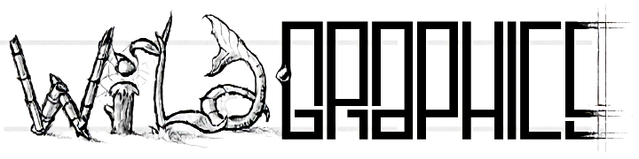

# WildGraphics newsletter (1994-1996)

## TLDR;

"Wild Graphics" was a project that aimed to explore the possibilities of graphic creation by combining manual painting techniques and those based on mathematical models. The goal was to show how the two approaches can complement each other and give rise to innovative and unique works of art.

## Overwiew

"Wild Graphics" was a French newsletter that aimed to keep its subscribers informed and connected with the field of computer graphics and related subjects. The newsletter covered a wide range of topics, including presentations of its members, updates on recent events and developments in the industry, and a platform for members to share their ideas and projects.

It covered, among other things, the following topics:

- Festival de l'image de synthèse de Monte Carlo (Imagina)
- Image synthesis/CGI techniques
- Graphic design software and tools
- Fractals and mathematical models for graphics
- New developments and innovations in the field of CGI
- Description of programs such as LParser
- Coverage of American magazine "Wired"
- Books on virtual imagery/CGI
- Object generators (e.g. Coil, Pyramid, Shelly, Twister, PickShell)

The newsletter was edited by [Nicolas Mougel](https://github.com/DigitalBox98), who was responsible for a large portion of the text, layout, editing, and printing. The newsletter was published from 1994 to 1996, with a total of 16 issues, and was created using both [Amiga](https://en.wikipedia.org/wiki/Amiga) and PC computers. The newsletter aimed to be concise and informative, providing readers with a fresh perspective on the world of computer graphics.

Over the course of its publication, the newsletter covered topics such as object generators, American magazines, and new books on virtual imaging. Despite its conciseness, the newsletter also aspired to eventually feature more in-depth technical content, such as algorithms and mathematical formulas related to computer graphics and fractals.
